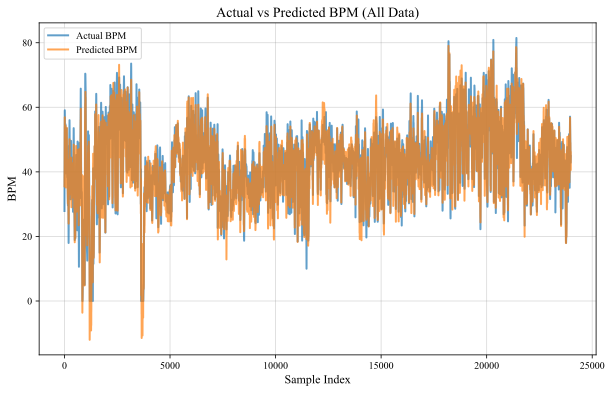
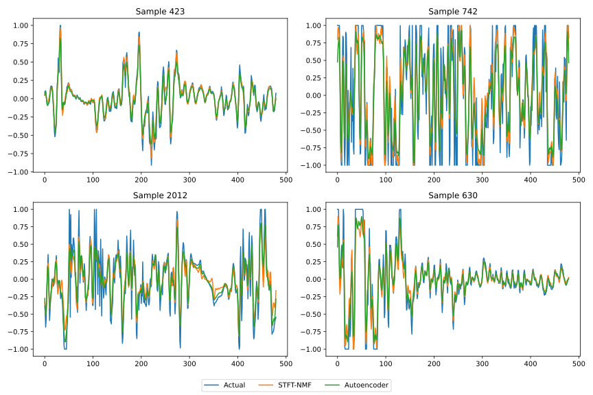

# freq_estimation_cnn

There are a lot of methods that let you estimate the frequency of a raw signal like heartbeat or breathing signals and get their frequencies. However, these methods are super hard to implement. On top of that, the old methods need a lot of considerations and adaptations to be used for a new signal.

In this super simple project, we're gonna use a simple convolutional neural network (CNN) to estimate the frequency of a raw signal with insane noise, or even saturation in signal. But the question is, how would a CNN model estimate the frequency of a raw signal? Let me explain.

A 1D-CNN model has multiple 1D "filters" called "kernels". These kernels are some kind of random 1D filters that each have their own characteristics. I mean a random vector could cover a range of frequencies. Right? After convolving these kernels into the raw signal, the outputs can somehow inform us about the kind of frequencies the signal may contain. After several layers of convolutional layer, these data are finally handed to the fully-connected layer, which would ultimately decide which frequency is dominant.

However, you need to "teach" the CNN model to learn the connections. I used a super simple CNN model and didn't even try to make it better. But you'll get above %95 in some cases.

Oh, and another cool idea is to use the trained CNN, then again train it in an CNN-Autoencoder model to filter out the noises.

I didn't want to share this superficial project, but some people use it as their M.Sc. thesis, I guess. So, there you go.

Text me if you're interested in this project and want the data.

CNN signal frequency estimation:

CNN-Autoencoder signal filtering:
